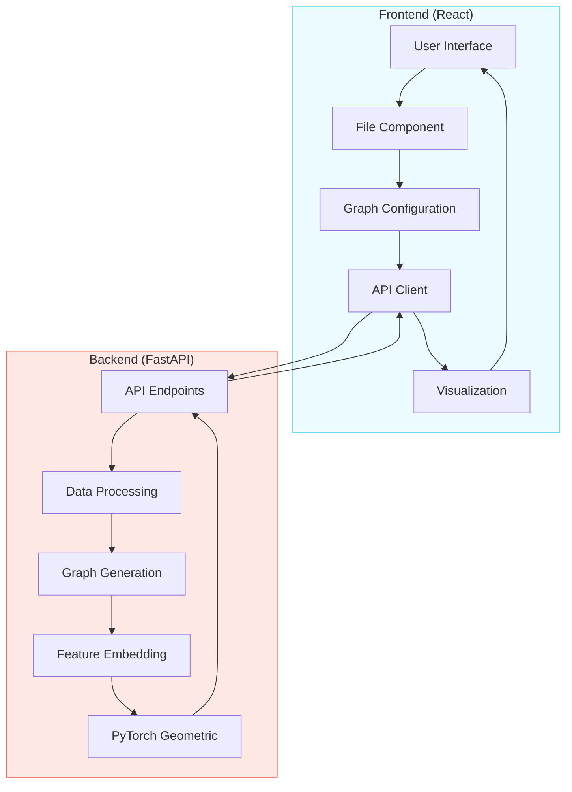
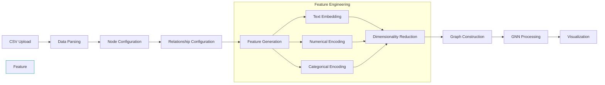

# Araneos: A Dynamic Graph Intelligence Platform for GNN-Driven Data Modeling


[](https://www.python.org/)
[](https://reactjs.org/)
[](https://pytorch.org/)
[](https://fastapi.tiangolo.com/)
[](https://opensource.org/licenses/MIT)
[](https://github.com/MaLoskins/GNN-Application/graphs/commit-activity)
[](https://github.com/MaLoskins/GNN-Application/pulls)

A comprehensive Graph Neural Network (GNN) application for transforming tabular data into graph representations with rich feature embeddings for machine learning and network analysis.

## 📋 Table of Contents

- [Araneos: A Dynamic Graph Intelligence Platform for GNN-Driven Data Modeling](#araneos-a-dynamic-graph-intelligence-platform-for-gnn-driven-data-modeling)
  - [📋 Table of Contents](#-table-of-contents)
  - [🔍 Overview](#-overview)
  - [✨ Features](#-features)
  - [🏗️ System Architecture](#️-system-architecture)
  - [🔄 Data Processing Pipeline](#-data-processing-pipeline)
  - [🛠️ Technologies Used](#️-technologies-used)
    - [Backend](#backend)
    - [Frontend](#frontend)
  - [📥 Installation](#-installation)
    - [Prerequisites](#prerequisites)
    - [Backend Setup](#backend-setup)
    - [Frontend Setup](#frontend-setup)
  - [🚀 Usage](#-usage)
    - [Running the Application](#running-the-application)
    - [Workflow](#workflow)
  - [📁 Project Structure](#-project-structure)
  - [👨‍💻 About the Author](#-about-the-author)

## 🔍 Overview

This GNN-Application is a powerful tool designed for researchers and data scientists working with graph neural networks. It provides a seamless way to transform tabular data (CSV) into graph representations with rich feature embeddings that can be used for various machine learning tasks.

The application consists of:

- A **Python backend** that handles data processing, graph construction, and feature embedding generation
- A **React frontend** that provides an intuitive interface for data upload, graph configuration, and visualization
- Integration with **PyTorch Geometric** for implementing various GNN architectures

Whether you're exploring network structures, analyzing relationships in your data, or developing new GNN models, this application provides the tools you need to streamline your workflow.

## ✨ Features

- **Dynamic Graph Construction**: Convert CSV data into graph structures with configurable node and relationship mappings
- **Advanced Feature Engineering**: Generate rich feature embeddings using techniques like BERT, GloVe, or Word2Vec
- **Interactive Visualization**: Explore and manipulate graph structures through an intuitive React interface
- **Multiple GNN Architectures**: Implement and experiment with various GNN models including GCN, GraphSAGE, GAT, and more
- **Customizable Processing Pipeline**: Configure preprocessing steps, embedding methods, and dimensionality reduction techniques
- **Real-time Graph Manipulation**: Edit nodes, create relationships, and see changes reflected instantly
- **Data Export Options**: Download processed graph data in various formats for further analysis

## 🏗️ System Architecture

The following diagram illustrates the overall system architecture, showing how the frontend and backend components interact:



## 🔄 Data Processing Pipeline

The diagram below shows the data flow through the GNN application, from file upload to graph visualization:



## 🛠️ Technologies Used

### Backend
- **Python** (v3.10.11)
- **FastAPI**: Modern, high-performance web framework
- **PyTorch & PyTorch Geometric**: Deep learning framework with GNN extensions
- **NetworkX**: Graph creation and manipulation
- **Pandas**: Data processing and manipulation
- **Transformers**: BERT and other embedding models
- **Scikit-learn**: Machine learning utilities
- **UMAP**: Dimensionality reduction

### Frontend
- **React**: UI library for building interactive interfaces
- **React Flow**: Interactive node-based UI
- **D3.js**: Data visualization library
- **Material UI**: Component library for modern UI design
- **PapaParse**: CSV parsing
- **React Force Graph**: Graph visualization
- **Axios**: HTTP client for API requests

## 📥 Installation

### Prerequisites
- Python 3.10.11
- Node.js (v14+)
- Git

### Backend Setup

1. Clone the repository:
   ```bash
   git clone https://github.com/MaLoskins/GNN-Application.git
   cd GNN-Application
   ```

2. Create and activate a virtual environment:
   ```bash
   python -m venv venv
   # On Windows
   venv\Scripts\activate
   # On macOS/Linux
   source venv/bin/activate
   ```

3. Install backend dependencies:
   ```bash
   cd backend
   pip install -r requirements.txt
   ```

### Frontend Setup

1. Navigate to the frontend directory:
   ```bash
   cd ../frontend
   ```

2. Install frontend dependencies:
   ```bash
   npm install
   ```

## 🚀 Usage

### Running the Application

1. Start the backend server:
   ```bash
   # From the backend directory
   uvicorn main:app --host 0.0.0.0 --port 8000
   ```

2. In a separate terminal, start the frontend development server:
   ```bash
   # From the frontend directory
   npm start
   ```

3. Open your browser and navigate to `http://localhost:3000`

### Workflow

1. **Upload Data**: Use the file uploader to import your CSV data
2. **Configure Graph**: Select which columns should be treated as nodes and define relationships between them
3. **Feature Configuration**: Enable advanced feature creation and select embedding methods (BERT, GloVe, Word2Vec)
4. **Process Graph**: Send your configuration to the backend for processing
5. **Visualize & Analyze**: Explore the resulting graph through the interactive visualization
6. **Export Results**: Download the processed graph data for further analysis or use in GNN models

## 📁 Project Structure

```
GNN-Application/
├── backend/                  # Python backend
│   ├── data/                 # Sample datasets
│   ├── tests/                # Backend tests
│   ├── DataFrameToGraph.py   # CSV to graph conversion
│   ├── FeatureSpaceCreator.py # Feature embedding generation
│   ├── TorchGeometricGraphBuilder.py # PyTorch Geometric integration
│   ├── main.py               # FastAPI server
│   └── requirements.txt      # Python dependencies
│
└── frontend/                 # React frontend
    ├── src/
    │   ├── components/       # React components
    │   │   └── GraphNet-Tab/ # Graph visualization components
    │   ├── hooks/            # Custom React hooks
    │   ├── styles/           # CSS styles
    │   ├── App.js            # Main application component
    │   └── index.js          # Application entry point
    └── package.json          # Node.js dependencies
```

## 👨‍💻 About the Author

**Matthew Haskins**  
University of Western Australia

<a href="https://maloskins.pages.dev/cv" target="_blank" rel="noopener" title="Portfolio">Portfolio</a> |
<a href="https://github.com/MaLoskins?tab=repositories" target="_blank" rel="noopener" title="GitHub">GitHub</a> |
<a href="https://www.linkedin.com/in/matthew-haskins-2875a41ab/" target="_blank" rel="noopener" title="LinkedIn">LinkedIn</a>

---

This project is designed to facilitate research and development in the field of Graph Neural Networks. If you have any questions or suggestions, please feel free to reach out through any of the channels above.
