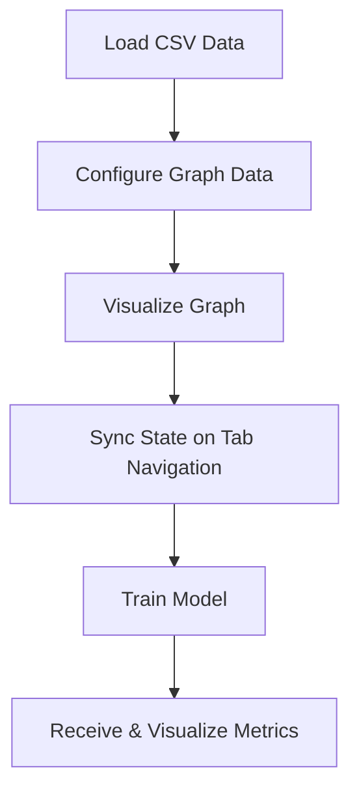
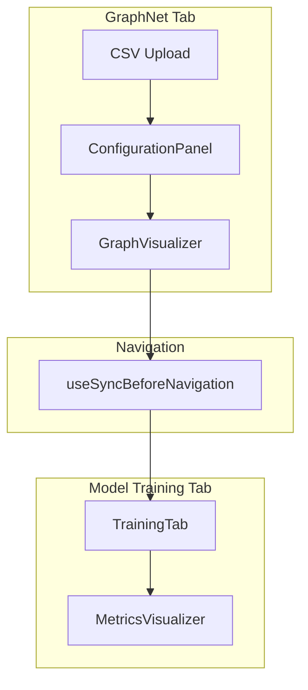

# Graph Data Synchronization: Data Flow, SAPPO Patterns, and Developer Guide

## Overview

This document details the **Graph Data Synchronization** implementation between the GraphNet and Model Training tabs. It covers the complete data flow, SAPPO architectural patterns, resolved problems, and provides clear usage guidelines for developers. It also explains the critical race condition fix, the role of `syncFlowToGraphData`, and best practices for robust state synchronization.

---

## 1. Data Flow: From CSV to Metrics

The following sequence describes the lifecycle of graph data in the application:



**Step-by-step:**

1. **Load CSV Data**: User uploads a CSV file via the GraphNet tab.
2. **Configure Graph Data**: User maps CSV columns to graph nodes/edges using the ConfigurationPanel.
3. **Visualize Graph**: The graph is rendered interactively (GraphVisualizer).
4. **Sync State on Tab Navigation**: When navigating to the Model Training tab, the current graph state is persisted and synchronized using the `useSyncBeforeNavigation` hook and `syncFlowToGraphData` function.
5. **Train Model**: The synchronized graph data is used to train models in the TrainingTab.
6. **Receive & Visualize Metrics**: Training results and metrics are displayed to the user.

---

## 2. SAPPO Components and Patterns

### :ArchitecturalPattern

- **State Synchronization Pattern**: Ensures that all user changes to graph data are reliably persisted before navigation, preventing data loss.
- **React Context API Pattern**: Centralizes graph data state using React's Context API, providing a single source of truth across tabs.

### :TechnologyVersion

- **React 18**: Leverages concurrent rendering and hooks for robust state management.
- **React Router**: Handles navigation and route changes, integrated with synchronization logic.
- **useContext**: Provides access to shared graph data and update functions.

### :Problems Addressed

- **:AsyncNavigationRaceCondition**: Prevents navigation before data is fully persisted.
- **:DataPersistenceIssue**: Ensures graph data is not lost or stale during tab switches.
- **:ComponentStateSynchronization**: Maintains consistent state across all relevant components.

---

## 3. The Race Condition Issue

### Problem

Previously, rapid navigation between the GraphNet and Training tabs could trigger overlapping state updates. If a user switched tabs before the graph data was fully persisted, the Training tab could receive incomplete or stale data, resulting in data loss or inconsistent model training.

### Solution

The fix introduces a synchronization barrier: navigation is **blocked** until the current graph state is fully persisted. This is achieved by:

- Using the `syncFlowToGraphData` function, which **awaits** the completion of data persistence (including localStorage and context updates).
- Integrating this logic into the `useSyncBeforeNavigation` hook, which intercepts navigation events and only allows them to proceed after successful sync.

---

## 4. Key Synchronization Patterns & Code Snippets

### GraphDataContext and Persistence

The `GraphDataContext` provides centralized state for graph data, accessible across all tabs:

```js
// frontend/src/context/GraphDataContext.js
import React, { createContext, useState, useEffect } from 'react';

export const GraphDataContext = createContext();

export function GraphDataProvider({ children }) {
  const [graphData, setGraphData] = useState(() => {
    // Load from localStorage on mount
    const stored = localStorage.getItem('graphData');
    return stored ? JSON.parse(stored) : null;
  });

  useEffect(() => {
    // Persist to localStorage on change
    if (graphData) {
      localStorage.setItem('graphData', JSON.stringify(graphData));
    }
  }, [graphData]);

  return (
    <GraphDataContext.Provider value={{ graphData, setGraphData }}>
      {children}
    </GraphDataContext.Provider>
  );
}
```

### Synchronizing Before Navigation

The `useSyncBeforeNavigation` hook ensures that navigation is **awaited** until data is persisted:

```js
// frontend/src/hooks/useSyncBeforeNavigation.js
import { useContext } from 'react';
import { GraphDataContext } from '../context/GraphDataContext';
import { useNavigate } from 'react-router-dom';

export function useSyncBeforeNavigation() {
  const { graphData } = useContext(GraphDataContext);
  const navigate = useNavigate();

  async function syncFlowToGraphData(nextPath) {
    // Example: persist graphData to localStorage and/or backend
    await persistGraphData(graphData);
    navigate(nextPath);
  }

  return { syncFlowToGraphData };
}

// Example persistence function
async function persistGraphData(data) {
  // Simulate async persistence (e.g., API call or localStorage)
  return new Promise((resolve) => {
    localStorage.setItem('graphData', JSON.stringify(data));
    setTimeout(resolve, 100); // Simulate delay
  });
}
```

**Pattern:**  
- Navigation is only triggered after `persistGraphData` completes, eliminating race conditions.

### Integration Example

```js
// In GraphNet tab component
const { syncFlowToGraphData } = useSyncBeforeNavigation();

function handleNavigateToTraining() {
  syncFlowToGraphData('/training');
}
```

---

## 5. Visual Diagram: Data Lifecycle



---

## 6. Developer Usage Guidelines

### How the Sync Process Works

- **State is updated** in the GraphNet tab as the user configures or edits the graph.
- **Before navigation** to another tab (e.g., Model Training), `useSyncBeforeNavigation`:
  - Detects the navigation event.
  - Triggers `syncFlowToGraphData`, which persists the current state.
  - **Awaits** confirmation that the state is persisted before allowing navigation.
- **On the destination tab**, the latest graph data is loaded and used for model training.

### Best Practices

- Always use the provided context and synchronization hooks for any graph data updates or navigation.
- Avoid direct manipulation of localStorage or navigation outside the prescribed hooks.
- When extending the graph data schema, ensure all new fields are included in the persistence and sync logic.
- Test edge cases, such as rapid tab switching or interrupted syncs, to ensure robustness.

### Common Pitfalls & Warnings

- **Do not trigger navigation before awaiting data persistence**: This can reintroduce the original race condition.
- **Avoid multiple sources of truth**: All graph data should flow through the context and sync hooks.
- **Beware of stale closures**: When using async functions in hooks, ensure you reference the latest state.
- **Test with slow storage or network**: Simulate delays to ensure the UI blocks navigation until sync completes.

---

## 7. SAPPO Context and Technology Choices

- **:ArchitecturalPattern**: Implements a *Pre-Navigation Synchronization* pattern, ensuring state consistency across UI boundaries.
- **:TechnologyVersion**: React 18+, React Router, useContext.
- **:EnvironmentContext**: Requires a modern browser with ES6+ support. No server-side state is assumed for synchronization between tabs.
- **:Problems Addressed**: All major synchronization, race condition, and state management issues are mitigated by the current design.

---

## 8. Dual Testing Strategy

### CUMULATIVE TESTING

- **Approach**: Integration tests (e.g., `AppIntegration.test.js`, `GraphNetToTrainingIntegration.test.js`) verify that the entire data flow—from CSV upload to metrics visualization—remains stable as new features are added.
- **Contribution**: Each new test builds on the foundation, ensuring regressions are caught early.
- **System-wide Stability**: All historical tests (including those for useGraph, useSyncBeforeNavigation, and TrainingTab) are run together to guarantee end-to-end reliability.

### RECURSIVE TESTING

- **Not directly applicable**: The synchronization logic is not recursive in the algorithmic sense, but edge cases (such as repeated rapid navigation) are tested in a looped fashion to simulate recursion-like stress.

#### Example Test (Cumulative)

```js
test('Graph data is correctly synchronized when switching tabs rapidly', async () => {
  // Simulate user editing graph, then rapidly switching tabs
  // Assert that the Model Training tab receives the latest graph data
});
```

---

## 9. References

- [React Router: State Management](https://reactrouter.com/explanation/state-management)
- [React: Synchronizing with Effects](https://react.dev/learn/synchronizing-with-effects)
- [React Context for Route State](https://egghead.io/lessons/react-use-react-context-to-manage-application-state-through-routes)
- [Redux State Sync](https://dev.to/cassiolacerda/with-redux-3g41)
- [Real-time Data Synchronization in React](https://www.angularminds.com/blog/real-time-data-synchronization-in-react-application)

---

## 10. Summary

- **Data flow**: CSV → Config → Visualize → Sync → Train → Metrics
- **SAPPO patterns**: State Synchronization, React Context API, Pre-Navigation Sync
- **Problems fixed**: Async navigation race conditions, data persistence issues, state management issues
- **Testing**: Dual strategy (cumulative, recursive edge simulation)
- **MCP Usage**: Perplexity used for best practices and official documentation enrichment

---

*For further details, see the implementation in `frontend/src/hooks/useSyncBeforeNavigation.js`, `frontend/src/context/GraphDataContext.js`, and related test files.*